# INTEGRANTES
- Andersson David Sánchez Méndez
- Cristian Santiago Pedraza Rodríguez
- Ricardo Andres Ayala Garzon
- Santiago Botero García

# LABORATORIO 4 - Scrum - DI/IOC

# ELYSIUM

## PRE-RREQUISITOS
- Java OpenJDK Runtime Environment: 17.x.x
- Apache Maven: 3.9.x
- SpringBoot
- Docker
- AzureDevops
- Sonar
- Jacoco

## OBJETIVOS
1. Planeación de un proyecto de software.
2. Entender arquitectura cliente servidor.
3. Inyección de dependencias - Inversión de control.
4. Manejo de bases de datos no relacionales.
6. Definición de API Rest Con SpringBoot.
7. Realizar Análisis estático para garantizar calidad del código y detección de deuda técnica.
8. Integrar pruebas unitarias en el desarrollo del producto.

## CASO DE NEGOCIO - SISTEMA DE RESERVAS DE LABORATORIOS PARA LA DECANATURA DE INGENIERÍA DE SISTEMAS.

El proyecto consiste en una aplicación para la gestión de reservas de laboratorios dentro Ingeniería de Sistemas de la Escuela Colombiana de Ingeniería Julio Garavito. Los usuarios podrán consultar la disponibilidad de laboratorios, realizar reservas y cancelar sus reservas desde una interfaz web. La aplicación se conectará a un API REST desarrollado en Spring Boot. El backend permitirá la inyección de dependencias para el manejo de datos, pudiendo optar entre una base de datos en MongoDB Cloud o un archivo de texto plano para almacenar las reservas.

## REQUERIMIENTOS
- El usuario debe poder consultar la disponibilidad de laboratorios.
- El usuario debe poder reservar un laboratorio especificando fecha, hora y propósito.
- El usuario debe poder cancelar sus reservas.
- La aplicación debe validar que un laboratorio no se pueda reservar si ya está ocupado.

## MODELO DE ARQUITECTURA

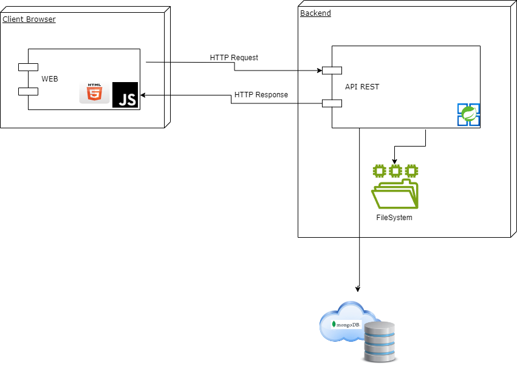

## PLANEACIÓN DEL PROYECTO.
- Esta sección tiene como objetivo realizar toda la planificación que el equipo de desarrollo requiere para poder dar inicio al proyecto planteado. Para este objetivo utilizaremos Azure DevOps.

- <a href="https://github.com/MicrosoftLearning/AZ400-DesigningandImplementingMicrosoftDevOpsSolutions/blob/master/Instructions/Labs/AZ400_M01_L01_Agile_Plan_and_Portfolio_Management_with_Azure_Boards.md">Tutorial Completo</a>

  1. Como primer paso, se crean dos repositorios en GitHub, tanto para el backend como para el frontend.

        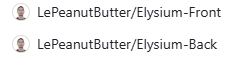
    

  2. Todos los integrantes del grupo crean su cuenta en AzureDevOps <a href="https://go.microsoft.com/fwlink/?LinkId=2014881" target="_blank">Crear una cuenta</a>

  3. Una vez ingresa deberá crear el proyecto. (Solo lo hace un integrante del equipo). Crea la organización, y dentro de esta crea el proyecto con configuración avanzada tipo de proceso Scrum, con visibilidad privada, y su descripción correspondiente.

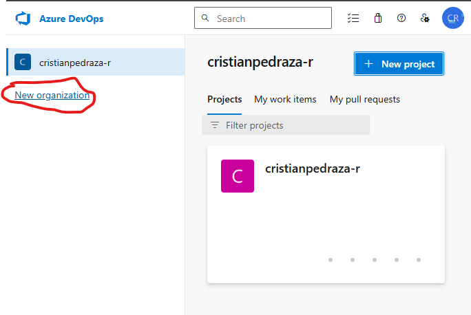

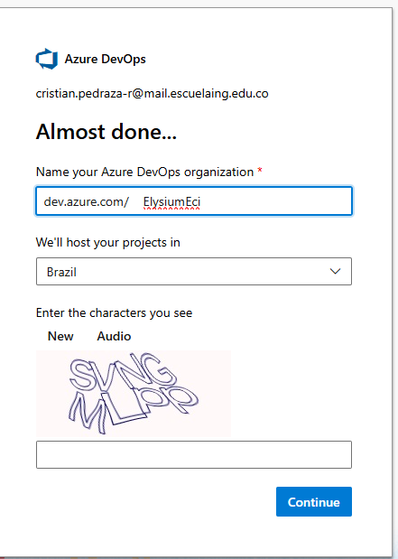

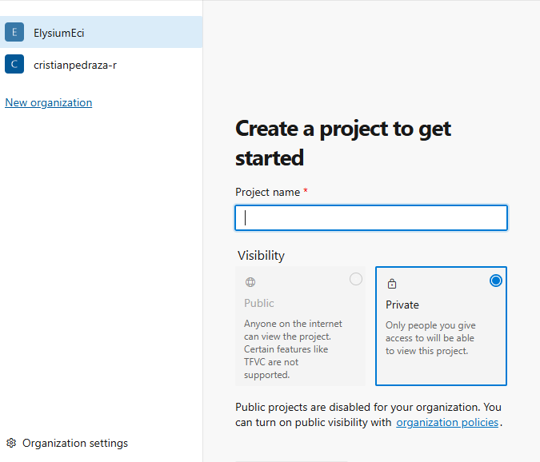

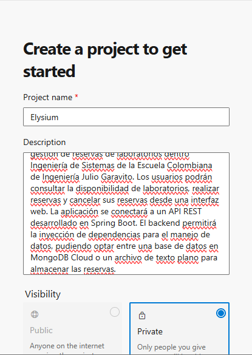

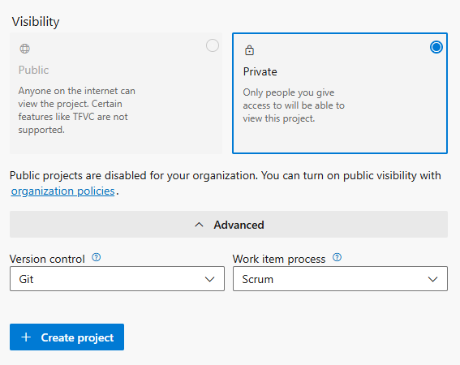

  4. Cree un equipo en el siguiente tutorial encontrará cómo hacerlo <a href="https://github.com/microsoft/azuredevopslabs/tree/master/labs/azuredevops/agile" target="_blank">Creando equipos</a>, para este proceso todos 
     los integrantes deberán tener una cuenta en AzureDevOps.

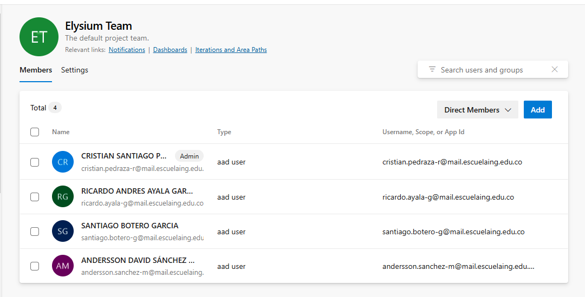

    
  5. Integre los repositorios de gitHub en la configuración de AzureDevOps
       From your project in Azure DevOps, go to Project settings > GitHub connections.
       To add or remove repositories, select the More options ellipses for the connection and choose Add repositories or Remove repositories from the menu.

   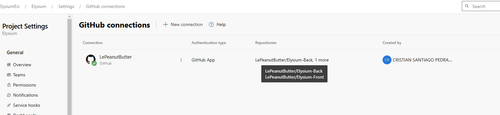

  6. Una vez integrados los repositorios, ahora, se configuran Iteration and Area Paths para habilitar la opción de añadir Épicas al proyecto. 

  7. Se dirige al nombre del equipo y selecciona la opción del inciso anterior, y habilita Epics.

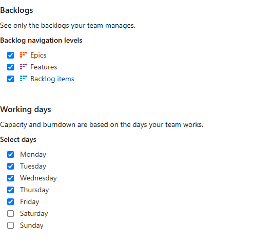

  8. Defina los spring del proyecto. luego para configurar, seleccionar la opción Iterations, select Iterations, determinar las fechas de cada Spring, y eliminar Springs innecesarios.

  ## SPRINTS
    Sprint 1: Configuración General del Proyecto (SCAFFOLDING)
    - Configuración de ambientes (backend y frontend).
    - Scaffolding del proyecto.
    - Configuración de la base de datos (MongoDB Cloud o archivo de texto plano).
    - Definición del modelo de datos (salones y reservas).

    Sprint 2: Implementación del API REST (BACK AND FRONT)
    - Crear los endpoints necesarios para consultar laboratorios, realizar reservas y cancelar reservas.
    - Implementar la lógica de validación para evitar reservas conflictivas.
    - Configurar la persistencia de datos en MongoDB Cloud o archivo de texto plano.

    Sprint 3: Conexión del Frontend con el API y Pruebas Finales (BACK AND FRONT)
    - Desarrollar la interfaz web para visualizar disponibilidad y gestionar reservas.
    - Conectar la interfaz web con el API REST.
    - Realizar pruebas de integración y validación de funcionalidades.

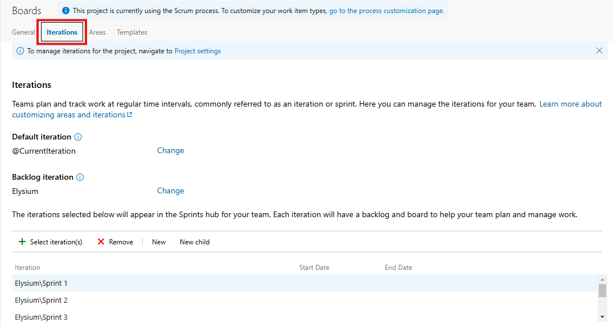

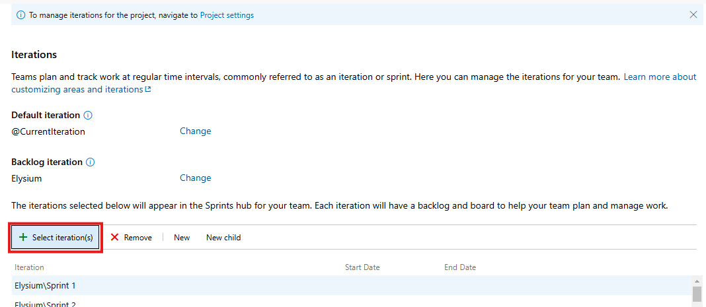

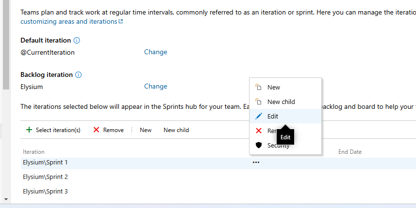

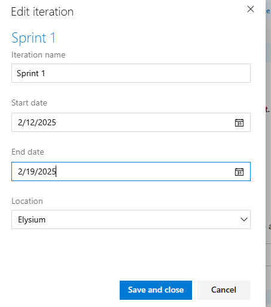

    
  9. Incluir subáreas para poder añadir las épicas correctamente. Para esto, se selecciona Areas, y en el nombre del proyecto se incluyen las subáreas, y se le da Ok.

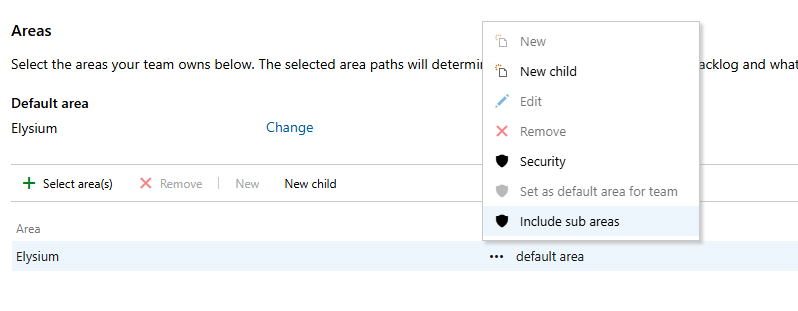

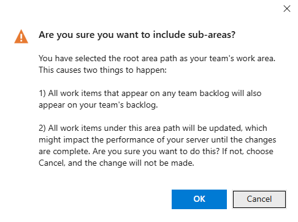

  10. Definiendo la épica, y añadirlas en el proyecto, dándole en la sección de Board Work Items --> Work Items --> new work item --> Epic --> con la descripción correspondiente.

    ## ÉPICAS
    1. Scaffolding: Crear la estructura del proyecto con Maven, así como también la configuración con MongoDB, y la definición del modelo de datos.
    2. Frontend: Crear una interfaz de usuario que permita visualizar la disponibilidad y gestionar reservas.
    3. Backend: Implementar un API REST para el manejo de la lógica de negocio y persistencia de datos.

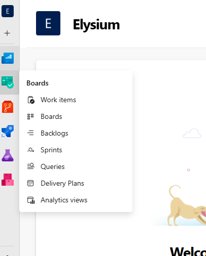

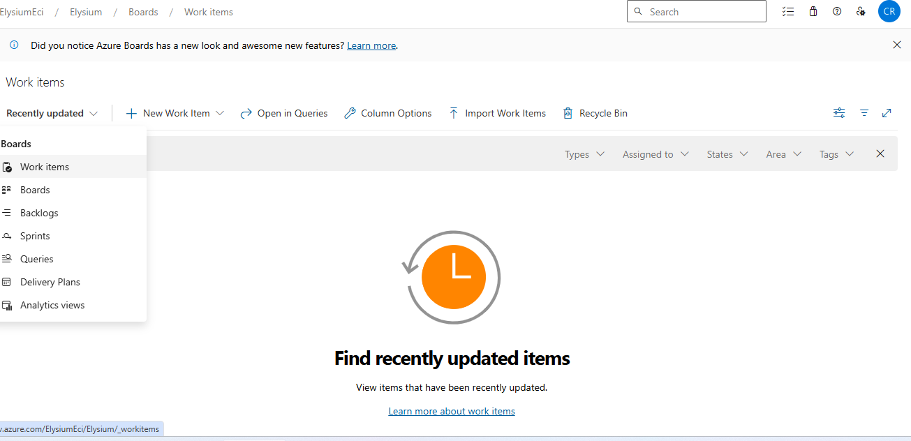

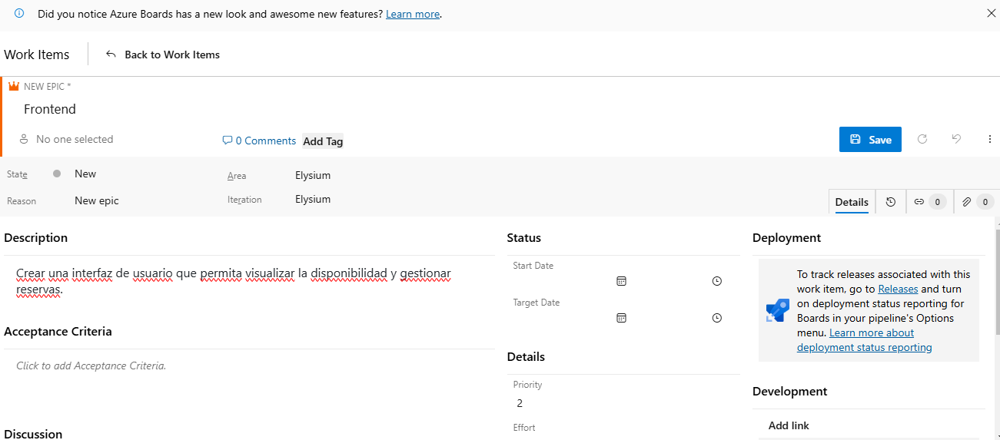

  7. Definir y añadir features para cada Epic. Para esto, se selecciona add link y en New Item se pone el nuevo feature. 

    ## FEATURES
    1. Consultar Disponibilidad: El usuario puede consultar la disponibilidad de laboratorios para una fecha y hora específicas.
    2. Reservar Laboratorio: El usuario puede reservar un laboratorio seleccionando fecha, hora y propósito.
    3. Cancelar Reserva: El usuario puede cancelar sus reservas existentes.
    4. Validación de Reservas: Evitar reservas duplicadas para un mismo laboratorio, fecha y hora.
    5. Notificación de Reserva Exitosa: Enviar una confirmación al usuario después de realizar la reserva.

  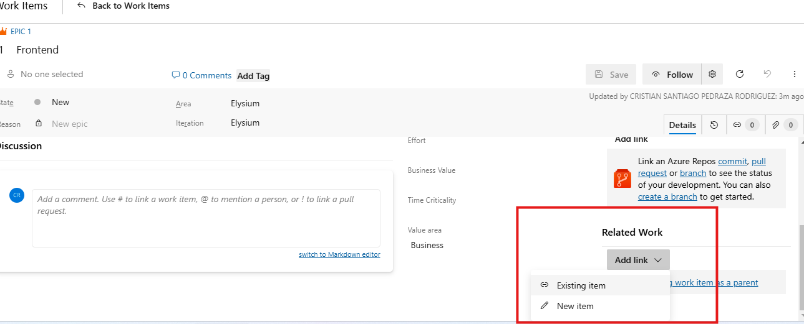

  8.  Defina las historias de usuario por cada feature definida.
  9.  Defina las tareas asociadas a cada historia de usuario. Estime tiempos y programe cada actividad con su equipo (squad)
 

## PASOS PARA CONSTRUIR EL PROYECTO

1- Definir el scaffolding del back <a href="https://ragunathrajasekaran.medium.com/https-medium-com-ragunathrajasekaran-lets-learn-full-stack-development-part2-7986debc485d" target="_blank">Ver guía</a> No olvide el que el proyecto debe ser maven. Mantenga el esquema de nombramiento de los artefactos.

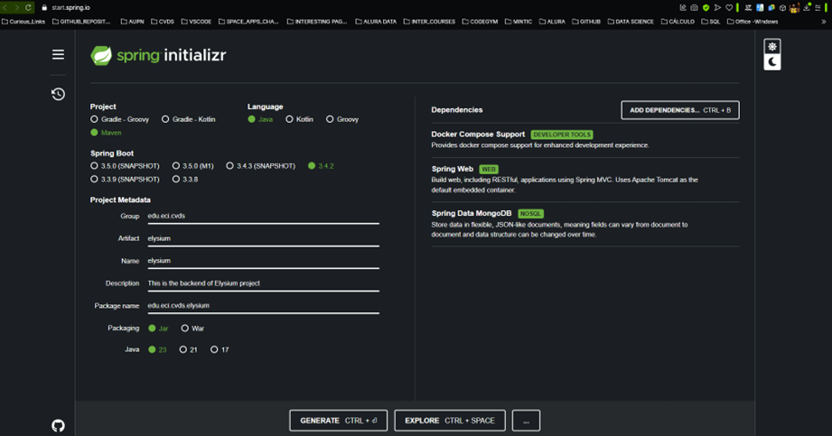
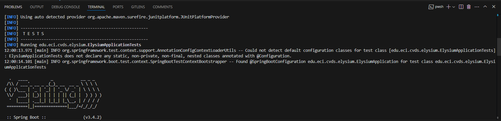
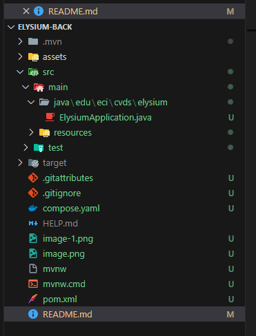

## IMPLEMENTACIÓN.
De acuerdo a la planeación realizada divida las tareas de implementación.
A continuación detallamos diferentes tutoriales para el manejo técnico para cada etapa.

  1. Creación de proyecto APIREST <a href="https://blog.codmind.com/mi-primer-api-rest-con-spring-boot/">Documentación 1<a/> <a href="https://programandoenjava.com/crear-un-rest-api-con-spring-boot/">Documentación 2</a>
  2. Consumir APIREST HTML - JAVASCRIPT <a href="https://helpcenter.itmplatform.com/es/project/ejemplo-de-uso-de-api-con-html-javascript/">Ejemplo básico<a/> Utilizar buenas prácticas de programación separación en archivos emplear CSS para mejorar la usabilidad.
  3. Configuración e integración <a href="https://www.mongodb.com/resources/products/compatibilities/spring-boot#getting-started-with-spring-initializr">MongoDB - Atlas</a>
  4. Utilizar integración con Sonar y JACOCO para análisis estático y calidad del código, esto implica el desarrollo de pruebas unitarias.

